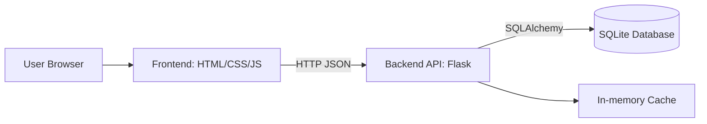

# Architecture Documentation

## Architecture style

The project uses a **modular monolith** architecture. The backend is deployed as one application, but internally it is divided into modules:

- controllers
- services
- repositories
- middleware
- models

This gives clear boundaries without the operational complexity of microservices.

## C4-style container view



## Layers

### Presentation tier

Responsible for:

- displaying product list
- login form
- creating orders
- showing error messages
- calling backend REST API

### Application tier

Responsible for:

- REST endpoints
- authentication and authorization
- product business rules
- order creation logic
- validation and error handling
- JSON logs
- health/readiness checks

### Data tier

Responsible for:

- users
- products
- orders
- order items
- data persistence

## Important request flow: create order

1. User logs in and receives JWT.
2. Frontend sends `POST /api/v1/orders` with Bearer token.
3. Auth middleware verifies the token.
4. Order service validates product IDs and stock.
5. Repository creates order and order items in the database.
6. Backend returns `201 Created`.
7. Frontend shows success message.

## Failure scenario

If the database is unavailable, `/ready` should return:

```json
{
  "status": "not-ready",
  "database": "unavailable"
}
```

with HTTP status `503`.
